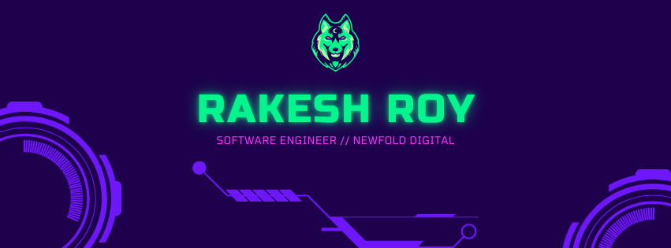

# 🥷 Tech Enthusiast & Problem Solver | WordPress Plugin Author

Hi, I’m **Rakesh Roy**, a passionate **Software Engineer** from 🇮🇳 India, driven by the goal of building impactful solutions. With **9+ years of experience**, I specialize in creating **high-performance websites** and **scalable solutions** using modern technologies like **WordPress**, **Laravel**, and **Inertia.js**.

As a **WordPress Plugin Author**, I’ve developed **custom themes and plugins**, optimized site performance for **enterprise-scale platforms**, and contributed extensively to **open-source projects**. My notable contributions include creating plugins like the **Bitly URL Shortener**, which has empowered thousands of users worldwide.

In addition to coding, I’ve **led teams** to deliver complex projects, including architecting workflows for **high-traffic platforms**. By fostering collaboration and adopting innovative practices, I ensure teams meet goals efficiently while maintaining **code quality** and **scalability**.

I’m committed to combining **technical expertise** with **leadership skills** to drive impactful change in the web development ecosystem.

## 💡 About Me  
- 👯 I’m looking to collaborate on **InartiaJs with React** projects.  
- 🙏 Open to learning and guidance on **TypeScript** best practices.  
- 🌱 Going dip in PHP and creating small php packages.
- 💬 Ask me about **WordPress Block Development**, **PHP**, and **eCommerce Solutions**.  
- 📫 Reach me at: **royrakesh.cob@gmail.com**
- 🌐 Visit my portfolio **https://royrakesh.dev**
- ⚡ Fun Fact: I’m a foodie at heart and love experimenting with cuisines!  

---

## 💻 Core Skills  

  

---

## 📌 My Notable Achievements  
- ⚙️ Created the [**Bitly URL Shortener WordPress Plugin**](https://wordpress.org/plugins/codehaveli-bitly-url-shortener/) , with over **11 thousands of downloads**.  
- 🚀 Contributed to high-traffic websites. 
- 🛠️ Built custom WooCommerce payment gateways and enterprise-level projects.
- 🏆 Led teams to deliver complex, high-traffic projects while fostering collaboration and scalability.  

---

## 📢 Let's Connect  

