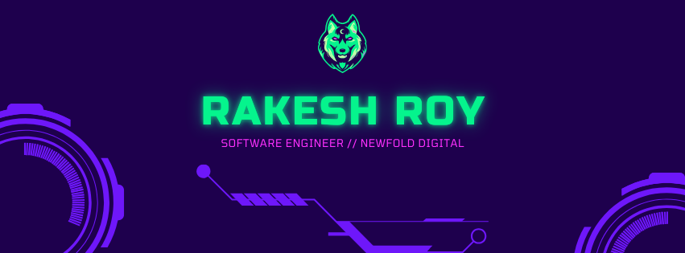

# 🥷 Open-Source Builder & Engineering Leader | WordPress Plugin Author

**Hey, I’m Rakesh Roy** — an engineer who grew from shipping features to shaping systems and teams. I work at the intersection of **open-source contribution, platform engineering, and scalable web architecture**.

I spend my days solving performance problems, modernizing WordPress ecosystems, and building developer-focused tools that make systems easier to maintain at scale. Alongside that, I lead engineers, guide architecture decisions, and help teams ship reliable software without burning out.

---

## 🌍 What I Actually Do

I’m not just writing code — I’m designing systems that other engineers can build on confidently.

- Build and maintain **production WordPress platforms** handling large traffic volumes  
- Develop systems using **TypeScript, React, and Next.js**  
- Create **developer tools and reusable PHP packages**  
- Design **cloud-aware backup and infrastructure systems**  
- Work deeply with **hosting platforms and domain product ecosystems**  
- Improve **performance, architecture, and long-term maintainability**  
- Mentor engineers and help teams move from “it works” → “it scales”  

---

## 🧩 Open-Source & Community Work

Open source is where I experiment, learn fast, and give back.

- Author of a widely used **Bitly integration plugin for WordPress**  
- Contributor to tooling that simplifies **plugin architecture and WordPress workflows**  
- Builder of internal-style tools in public — focused on **automation, clean structure, and developer experience**  
- Strong advocate of **modular PHP design and modern standards** in legacy ecosystems  

I enjoy turning real-world engineering problems into reusable solutions others can benefit from.

---

## 🏗 Engineering Leadership

I currently manage a team of **5 skilled engineers**, guiding delivery, architecture decisions, and engineering quality — while still contributing hands-on to critical systems.

My leadership philosophy:  
**Strong systems + empowered engineers = sustainable velocity**

I focus on:
- Creating clarity in complex technical decisions  
- Raising code quality standards without slowing teams down  
- Encouraging ownership and architectural thinking  
- Reducing technical debt through structure, not shortcuts  
- Bridging business priorities with engineering realities  

I still code regularly — staying close to implementation helps me lead with context, not theory.

---

## 💻 Core Skills

---

## 🚀 Current Engineering Focus

- Modernizing **WordPress plugin architecture**  
- Building **cloud-ready backup solutions**  
- Creating **clean PHP skeleton structures**  
- Improving systems behind **hosting and domain-driven platforms**  
- Making legacy systems more maintainable without full rewrites  

---

## 📌 Notable Achievements

- ⚙️ Author of the **Bitly URL Shortener WordPress Plugin** with **11k+ downloads**  
- 🚀 Delivered solutions for **high-traffic hosting platforms**  
- 🛠️ Built **custom WooCommerce payment gateways** and enterprise WordPress systems  
- 🏆 Leading engineers delivering complex, large-scale initiatives  
- 📦 Active contributor to open-source tooling and developer productivity systems  

---

## 📢 Let's Connect

---

### 🧠 Engineering Mindset

Great engineering isn’t about clever code — it’s about **clarity, reliability, and enabling others to move faster**.  
My goal is to build platforms, tools, and teams that scale long after individual features are forgotten.
